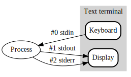
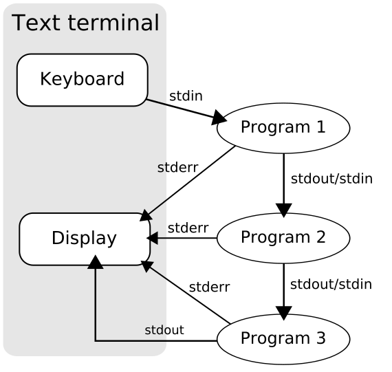
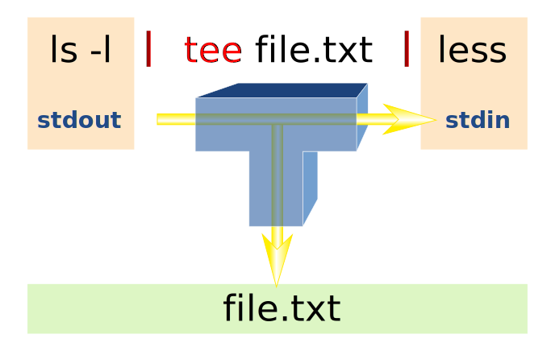

# Streams

Linux has 3 core *file streams*:
* `stdin`  --> defaults to keyboard (abbrev 0)
* `stdout` --> defaults to screen (abbrev 1)
* `stderr` --> defaults to screen (abbrev 2)



But any of these "hoses" can be redirected to point to a file (this is
possible because, under the hood, Linux represents *everything* to the
user -- even hardware like the monitor or keyboard -- as if it were a
file)

# Redirection operators

```
>                              # redirect stdout to a file (clobbers)
1>                             # same as above
>>                             # redirect stdout to a file (appends)
2>                             # redirect stderr to a file (clobbers)
2>&1                           # redirect stderr to wherever stdout is
                               # (order of redirections matters!)
```

# Pipes

Many Linux commands and utilities are designed to take input from
`stdin` (when not otherwise specified) and sent output to `stdout`
(when not otherwise specified).  The pipe operator `|` is placed
between two commands that sit on a single line (each command gets its
own `stdin` and `stdout` "hose"), and the `stdout` hose of the command
on the left gets plugged into the `stdin` hose of the command on the
right.

For example:
```
$ cat file1 file2 | head | tail
```




## Some useful text filtering utilities that work this way

```
cat
tr
wc
uniq
sort
comm
cut
```

## `curl` and `wget` can both send output to `stdout`

`curl` does it by default.  To see how to make `wget` do so:
```shell
$ man wget
```

## You can pipe into `less`

This is useful for examining the results of a pipeline as you build it
(just pipe into `less` as you go, examine the output, then remove the
less and add the next stage of the pipeline).

## Redirecting both to a stream *and* a file?

Use the `tee` command:

```shell
$ <cmd1> | tee file1.txt file2.txt ... fileN.txt
# Sends contents of cmd1's stdout *both* to screen *and* to files file1.txt ... fileN.txt
```



To make `tee` append to rather than clobber (overwrite) the file(s) it
writes to, use the `-a` option:
```shell
$ <cmd1> | tee -a file1.txt
# Sends contents of cmd1's stdout *both* to screen *and* append output to file1.txt
```


## Making the output of Command 1 the *arguments* of Command 2

Some commands do not accept input from `stdin`.  For instance, `echo`
does not (at least not by default):
```shell
$ echo Hello | echo
# Nothing comes out
```

To get the 2nd `echo` to say "hello", we need the output of the 1st
`echo` to become the *argument* of the 2nd `echo`.  The utility that
accomplishes this is `xargs` :
```shell
$ echo Hello | xargs echo
$ echo Hello | xargs   # also works, b/c `echo` is default cmd for xargs
$ echo helloworld.jpg | xargs touch
# What happens?
```

Really, `xargs` builds new command line(s) based on whatever it gets
via `stdin`.  Let's check out its manpage (and note that, when you
don't tell `xargs` what command to use, it inserts `echo` as the
default).

A fuller but brief tutorial on usage of `xargs` can be found
[here](https://linuxize.com/post/linux-xargs-command/).


## Exercise: Word-frequency in US Declaration of Independence

Using only the utilities we've seen so far, write a *single pipeline*
that will ultimately output (both to `stdout` *and* to a file called
`usdechistogram.txt`) the top 10 words, by frequency (and ignoring
case) in the US Declaration of Independence, along with the number of
times each occurs.

This group exercise will require a lot of reading of `man` pages and
iterative trial and error, and it brings together most (or all) of the
skills we've learned so far.  Go for it!

